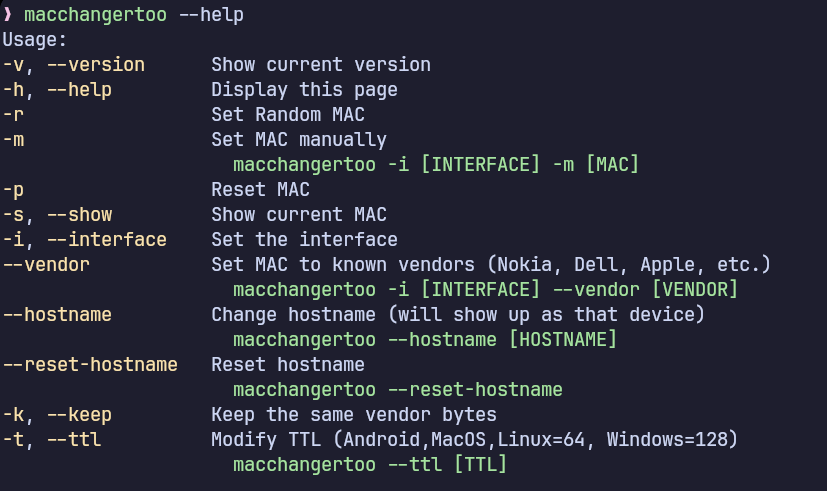

# macchangertoo

Yet another tool which changes device's MAC address.


---
### **About**

This tool changes your device's MAC address. It offers more features than any other tool you have been using **even with extra ones** (give it a try) but works only on Linux.

While you can fully spoof your device on home networks, it won't work on **public** networks because of WIDS and WIPS.

---

### **Features**

* With it you can:
  * Randomize your MAC address
  * Change it manually
  * Reset it back to permanent
  * Set MAC address to known vendors
  * Change the hostname
  * Reset the hostname
  * Change TTL

---
### **Requirements**

* Should work on any **Linux** (even on **Android** (with sudo configured)(doesn't fully work)) system which uses **NetworkManager**.
* **Packages**: make, g++, git, awk, ip.

---
### **Usage**



---
### **Installation**

* Run:
```bash
git clone https://github.com/TypingWalrus/macchangertoo
cd macchangertoo/main

make
```

* For it to be accessible anywhere on the system:
```bash
sudo mv macchangertoo /bin
```

---
Thank you for visiting!
